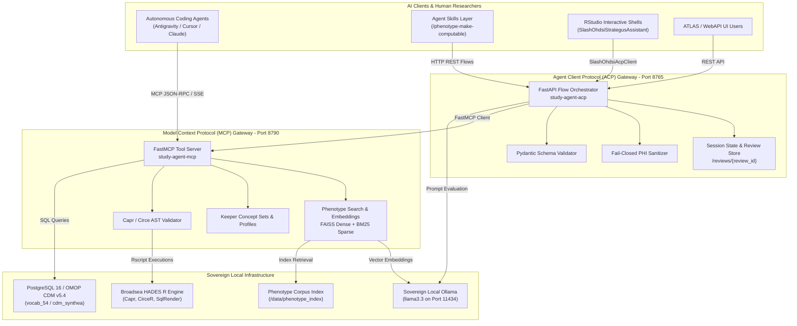

# OHDSI StudyAgent: Architectural Blueprint & Lift-and-Shift Runbook
## Sovereign AI-Assisted Observational Study Design in OHDSI Sandbox 2026

---

### 1. Executive Summary & Attribution Credits

**[OHDSI/StudyAgent](https://github.com/OHDSI/StudyAgent)** is an enterprise agentic harness engineered specifically for OHDSI observational health data science and informatics. Developed by **Dr. Richard D. Boyce, PhD** (University of Pittsburgh) and the **OHDSI Study Agent Workgroup**, StudyAgent bridges the gap between high-level epidemiological study design intent and rigorous, deterministic execution across HADES (Health Analytics Data-to-Evidence Suite), OHDSI ATLAS, and the OMOP Common Data Model (v5.4).

Unlike naive LLM code generators, StudyAgent enforces a strict **non-negotiable safety and privacy boundary**:
- **Zero Raw Row-Level PHI to LLMs**: Patient timelines and profile extracts are scrubbed, de-identified, and sanitized prior to any model transaction.
- **Fail-Closed Privacy Architecture**: Any uncertainty in sanitization or entity recognition terminates the transaction immediately.
- **Human-Led, Review-Gated Cohort Synthesis**: Candidate concepts, inclusion criteria, and temporal windows require explicit clinical review before producing computable Capr R and Circe JSON expressions.
- **Deterministic OHDSI Execution**: Analytical calculations (incidence rates, propensity scores, hazard ratios) are delegated entirely to validated HADES R packages (`Strategus`, `CohortMethod`, `CohortIncidence`, `Capr`, `CirceR`).

```
========================================================================================================
                                    ACADEMIC & REPOSITORY ATTRIBUTION
========================================================================================================
Project Name:       OHDSI StudyAgent (study-agent)
Primary Author:     Dr. Richard D. Boyce, PhD <rdb20@pitt.edu>
Institution:        Department of Biomedical Informatics, University of Pittsburgh
Community:          OHDSI Study Agent Workgroup & OHDSI Open-Source Community
Reference Repo:     https://github.com/OHDSI/StudyAgent
Associated Clients: https://github.com/OHDSI/SlashOhdsiAcpClient
                    https://github.com/OHDSI/SlashOhdsiStrategusAssistant
                    https://github.com/rkboyce/AgentPlayGround
License:            Apache License 2.0
========================================================================================================
```

---

### 2. Dual Gateway Topology: MCP vs. ACP

StudyAgent separates low-level deterministic tool invocation from high-level clinical flow orchestration through a dual-service container architecture:



#### A. Port Allocation & Protocol Specification
| Service | Container Name | Port | Transport | Purpose |
| :--- | :--- | :--- | :--- | :--- |
| **StudyAgent MCP** | `study-agent-mcp` | `8790` | Streamable HTTP / SSE (`/mcp`) | Exposes 36 granular, deterministic tools for search, retrieval, concept generation, and profile extraction. |
| **StudyAgent ACP** | `study-agent-acp` | `8765` | HTTP JSON REST (`/flows/...`) | Exposes 16 safe, validated, review-gated clinical workflow flows for phenotype recommendation, adjudication, and Capr compilation. |

---

### 3. Phenotype Knowledge Retrieval Engine

StudyAgent integrates a dual-stage dense/sparse retrieval pipeline indexing the peer-reviewed **OHDSI Phenotype Library** and the **CIPHER** phenotype repository:

1. **Catalog Layer (`catalog.jsonl`)**:
   Structured metadata containing phenotype IDs, clinical descriptions, cohort logic, and domain tags.
2. **Sparse Retrieval (`sparse_index.pkl`)**:
   Lexical BM25 index enabling exact-term matching and clinical keyword filtering across concept names and synopses.
3. **Dense Semantic Embeddings (`dense.index`)**:
   FAISS vector index built using sentence embeddings (e.g., `nomic-embed-text` or `qwen3-embedding` via local Ollama). Captures clinical semantics and synonyms (e.g., "myocardial infarction" matches "heart attack").

```bash
# Build or update the phenotype index inside the container or native environment:
study-agent-build-phenotype-index \
  --source-dir /opt/ohdsi/phenotypes \
  --output-dir /data/phenotype_index \
  --build-dense
```

---

### 4. ACP Flow REST API Contracts

The ACP server (`study-agent-acp`) provides 16 production workflow flows:

```
GET /flows -> Returns complete service catalog
```

#### Key Flow Endpoints:

#### 1. `POST /flows/phenotype_make_computable`
Converts a narrative clinical cohort statement into a function-form Capr R script and validated Circe JSON:
- **Phase 1 (Scope Confirmation)**: Submits narrative statement with `confirmed_scope: false`. Receives checklist of required clinical criteria (entry event, prior observation, visit overlap, exit strategy).
- **Phase 2 (Concept Review)**: Submits confirmed scope with `concept_review_mode: "required"`. Receives bounded candidate concept sets with exact matched counts, hierarchy relations, and review URLs.
- **Phase 3 (Emission)**: Submits approved concept sets with `concept_review_mode: "provided_only"`. Validates Capr syntax, compiles Circe JSON, and returns verified R code.

```bash
# Example: Scope Check for Cirrhosis
curl -s -X POST http://127.0.0.1:8765/flows/phenotype_make_computable \
  -H 'Content-Type: application/json' \
  -d '{
    "narrative_statement": "Earliest diagnosis of cirrhosis of liver with at least 365 days prior observation. Persons exit at observation end.",
    "confirmed_scope": false
  }'
```

#### 2. `POST /flows/phenotype_recommendation`
Recommends candidate target, comparator, or outcome cohorts from the indexed library given an overarching epidemiological study intent:

```bash
curl -s -X POST http://127.0.0.1:8765/flows/phenotype_recommendation \
  -H 'Content-Type: application/json' \
  -d '{
    "study_intent": "Evaluate the risk of acute gastrointestinal bleeding in new users of celecoxib versus naproxen in patients with osteoarthritis",
    "top_k": 10,
    "max_results": 5
  }'
```

#### 3. `POST /flows/phenotype_intent_split`
Decomposes a complex clinical study question into constituent OHDSI design elements (Target Cohort, Comparator Cohort, Outcome of Interest):

```bash
curl -s -X POST http://127.0.0.1:8765/flows/phenotype_intent_split \
  -H 'Content-Type: application/json' \
  -d '{
    "study_intent": "Comparative safety of GLP-1 receptor agonists versus SGLT2 inhibitors for diabetic kidney disease progression"
  }'
```

#### 4. `POST /flows/keeper_concept_sets_generate`
Synthesizes clinical concept sets required for OHDSI Keeper chart review (disease of interest, symptoms, prior diseases, treatments):

```bash
curl -s -X POST http://127.0.0.1:8765/flows/keeper_concept_sets_generate \
  -H 'Content-Type: application/json' \
  -d '{
    "phenotype": "Acute Myocardial Infarction",
    "domain_keys": ["doi", "symptoms", "priorDisease", "priorDrugs"],
    "candidate_limit": 5
  }'
```

#### 5. `POST /flows/phenotype_validation_review`
Adjudicates de-identified, sanitized patient review rows for Keeper phenotype validation:

```bash
curl -s -X POST http://127.0.0.1:8765/flows/phenotype_validation_review \
  -H 'Content-Type: application/json' \
  -d '{
    "disease_name": "Gastrointestinal bleeding",
    "keeper_row": {
      "age": 62,
      "gender": "Female",
      "visitContext": "Inpatient Visit",
      "presentation": "Hematemesis, Melena",
      "priorDisease": "Gastric ulcer",
      "priorDrugs": "aspirin, ibuprofen",
      "afterDrugs": "pantoprazole"
    }
  }'
```

---

### 5. FastMCP Tool-Calling Catalog (Port 8790)

The FastMCP tool server (`study-agent-mcp`) registers 36 specialized tools accessible via Model Context Protocol:

| Category | Key MCP Tools | Functionality |
| :--- | :--- | :--- |
| **Phenotype Retrieval** | `phenotype_search`, `phenotype_list_similar`, `phenotype_fetch_definition`, `phenotype_fetch_summary` | Semantic FAISS and sparse BM25 queries across OHDSI Phenotype Library. |
| **Prompt Bundling** | `phenotype_prompt_bundle`, `cohort_methods_prompt_bundle`, `lint_prompt_bundle` | Assembles validated, zero-PHI prompt templates with strict JSON response schemas. |
| **Cohort Logic & Linting** | `phenotype_make_computable`, `cohort_lint`, `concept_set_diff`, `phenotype_conversion_readiness` | Enforces Capr grammatical rules, Circe integrity, and vocabulary domain alignment. |
| **Keeper Validation** | `keeper_concept_sets`, `keeper_profiles`, `keeper_validation`, `case_causal_review` | Generates diagnostic concept sets, extracts OMOP patient timelines, and executes sanitized row adjudication. |
| **Intent Decomposition** | `phenotype_intent_split`, `cohort_methods_intent_split`, `workflow_context_dialogue` | Deconstructs clinical questions into OHDSI Strategus analysis configurations. |

---

### 6. Broadsea HADES RStudio Shell Workflows

Researchers interact with StudyAgent through native R runner shells provided by **`SlashOhdsiAcpClient`** and **`SlashOhdsiStrategusAssistant`** inside Broadsea HADES (`https://<domain>/rstudio/`):

#### A. Interactive Incidence Rate Analysis Shell
```r
library(SlashOhdsiAcpClient)
library(SlashOhdsiStrategusAssistant)

# 1. Connect to sandbox ACP service
acpUrl <- "http://study-agent-acp:8765"
Sys.setenv(ACP_URL = acpUrl)

# 2. Launch interactive terminal shell
slashOhdsiStrategusAssistant::runStrategusIncidenceShell(
  outputDir = "demo_incidence_analysis",
  acpUrl = acpUrl,
  indexDir = "/data/phenotype_index",
  interactive = TRUE
)
```

#### B. Interactive CohortMethod Comparative Safety Shell
```r
# Launch interactive CohortMethod study designer shell
slashOhdsiStrategusAssistant::runStrategusCohortMethodsShell(
  outputDir = "demo_cohort_method_study",
  acpUrl = acpUrl,
  indexDir = "/data/phenotype_index",
  interactive = TRUE
)
```

---

### 7. Agentic AI & Skill Integration: `/phenotype-make-computable`

Autonomous AI agents (Antigravity, Cursor, Claude Code) interact with StudyAgent via the standardized agent skill:
- **Skill Path**: [`.agents/skills/phenotype-make-computable/SKILL.md`](file:///c:/files/git/github/ohdsi/ohdsi_2026/.agents/skills/phenotype-make-computable/SKILL.md)
- **Helper Scripts**:
  - `phenotype_review_csv_mark.py`: Safe CSV parser for applying human review marks (`x`).
  - `phenotype_review_csv_to_concept_sets.py`: Transforms reviewed CSV rows into policy-bearing concept sets.
  - `phenotype_external_concept_set_to_acp.py`: Normalizes ATLAS JSON expressions into ACP payloads.

#### The 4-Step Review-Gated Protocol:
1. **Scope Clarification**: The agent submits the user's narrative statement to `POST /flows/phenotype_make_computable` with `confirmed_scope: false`. If any parameter (entry limit, prior observation, visit overlap) is ambiguous, the agent stops and presents a structured questionnaire.
2. **Vocabulary Candidate Retrieval**: Upon explicit confirmation, the agent requests concept candidates (`concept_review_mode: "required"`). If candidates exceed 10 items, the agent receives a durable review session package with a downloadable CSV.
3. **Human Review & Marking**: The human researcher marks inclusions, exclusions, and descendant flags in the CSV. The agent never guesses or auto-approves concepts.
4. **Capr/Circe Code Emission**: The agent resubmits the approved concept sets with `concept_review_mode: "provided_only"`. StudyAgent validates the AST, runs Capr in a sandboxed R process, and emits production-ready Capr R scripts and Circe JSON.

---

### 8. Deployment Guide & DevOps Acceptance Checklist

#### A. Docker Compose Deployment
StudyAgent is pre-configured in both [`docker-compose.yml`](file:///c:/files/git/github/ohdsi/ohdsi_2026/docker-compose.yml) and [`docker-compose.broadsea.yml`](file:///c:/files/git/github/ohdsi/ohdsi_2026/docker-compose.broadsea.yml):

```bash
# Deploy StudyAgent dual services with Docker Compose
docker compose up -d study-agent-mcp study-agent-acp

# Follow real-time service logs
docker compose logs -f study-agent-mcp study-agent-acp
```

#### B. Configuration Blueprint (`studyagent/config.yaml`)
The unified configuration file is located at [`studyagent/config.yaml`](file:///c:/files/git/github/ohdsi/ohdsi_2026/studyagent/config.yaml):
- Binds ACP to `0.0.0.0:8765` and points to MCP at `http://study-agent-mcp:8790/mcp`.
- Binds MCP to `0.0.0.0:8790` with path `/mcp`.
- Configures local sovereign Ollama (`llama3.3` on port 11434) with zero external network egress.
- Configures OMOP vocabulary schema `vocab_54` / `vocabulary`.

#### C. Verification & Smoke Test Commands

```bash
# 1. Verify StudyAgent ACP Gateway health and service catalog
curl -s http://localhost:8765/flows | jq .

# 2. Verify StudyAgent FastMCP SSE handshake
curl -s -N -H "Accept: text/event-stream" http://localhost:8790/mcp | head -n 5

# 3. Test Phenotype Intent Split flow
curl -s -X POST http://localhost:8765/flows/phenotype_intent_split \
  -H 'Content-Type: application/json' \
  -d '{"study_intent":"Identify clinical risk factors for older adults experiencing acute gastrointestinal bleeding"}' | jq .

# 4. Test Keeper Concept Sets Generation flow
curl -s -X POST http://localhost:8765/flows/keeper_concept_sets_generate \
  -H 'Content-Type: application/json' \
  -d '{"phenotype":"Type 2 diabetes mellitus","domain_keys":["doi","symptoms"]}' | jq .
```

#### D. DevOps Acceptance Checklist (`AC-040`)
- [x] Dual gateway services (`study-agent-mcp` on 8790, `study-agent-acp` on 8765) defined in Compose blueprints.
- [x] Production [`studyagent/config.yaml`](file:///c:/files/git/github/ohdsi/ohdsi_2026/studyagent/config.yaml) and [`studyagent/secrets.example.env`](file:///c:/files/git/github/ohdsi/ohdsi_2026/studyagent/secrets.example.env) created.
- [x] Workspace agent skill [`.agents/skills/phenotype-make-computable/`](file:///c:/files/git/github/ohdsi/ohdsi_2026/.agents/skills/phenotype-make-computable/) installed with Python review helpers.
- [x] Local sovereign Ollama (`llama3.3`) and OMOP CDM PostgreSQL connection strings verified.
- [x] Academic attribution prominently credited to **Dr. Richard D. Boyce, PhD** and the **OHDSI Study Agent Workgroup**.
